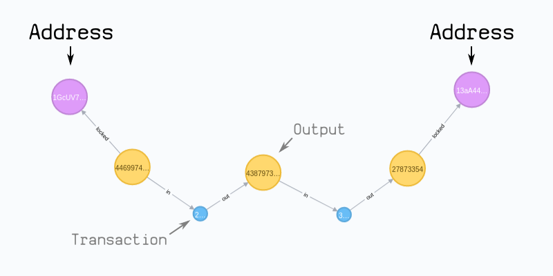

## Ravengraph
Visual representation of an asset and its transfers.



## Rationale
Modern block explorers are outdated. Graph databases allow for a better
visualization of digital assets and their corresponding transactions.

## Sample Neo4J Cypher Queries:
* Block
```
Merge (block:block {hash:$blockhash})
CREATE UNIQUE (block)-[:coinbase]->(:output:coinbase)
SET
   block.size=$size,
   block.prevblock=$prevblock,
   block.merkleroot=$merkleroot,
   block.time=$timestamp,
   block.bits=$bits,
   block.nonce=$nonce,
   block.txcount=$txcount,
   block.version=$version,
   
MERGE (prevblock:block {hash:$prevblock})
MERGE (block)-[:chain]->(prevblock)
```

* Transaction
```
MATCH (block :block {hash:$hash})
MERGE (tx:tx {txid:$txid})
MERGE (tx)-[:inc {i:$i}]->(block)
SET tx += {tx}    
    
WITH tx
FOREACH (input in $inputs |
         MERGE (in :output {index: input.index}) 
         MERGE (in)-[:in {vin: input.vin, scriptSig: input.scriptSig, sequence: input.sequence, witness: input.witness}]->(tx)
         )
            
FOREACH (output in $outputs |
         MERGE (out :output {index: output.index})
         MERGE (tx)-[:out {vout: output.vout}]->(out)
         SET
             out.value= output.value,
             out.scriptPubKey= output.scriptPubKey,
             out.addresses= output.addresses
         FOREACH(ignoreMe IN CASE WHEN output.addresses <> '' THEN [1] ELSE [] END |
                 MERGE (address :address {address: output.addresses})
                 MERGE (out)-[:locked]->(address)
                 )
        )
```

## Technology
    * Python    
    * Flask
    * Neo4J 
    * Ravencoin

## WCC2019 Hackathon - Las Vegas Blockchain Week

© Copyright 2019 Fodé Diop & Daniel Schafer - MIT License
